# Employee-Management

A simple employee management system website where admin can create new employees/admins and also update or delete existing employees. When an employee is created he/she needs to fill his/her personel information in the profile tab after logging in for the first time. After that the employee can see his/her personel details in the profile section. There is a search bar too (visible only to the admin) where admins can search for a particular employee. Admins can also view all the employees for a specific department.

## Getting Started

Fork and clone the repository and start the server using 

```
npm start
```

### Prerequisites

Things (npm pakages) you need to install and how to install them

```
express, express-session, hbs, mongodb, passport, passport-local, passport-facebook, passport-google-oauth20
```

### Installing

```
npm init
npm install
```


## Built With

* nodejs
* javascript
* jQuery
* css
* bootstrap
* html

## ScreenShots

### Desktop Views 
* Login page

 

* Home page (employees only)


* Home page (admins only)

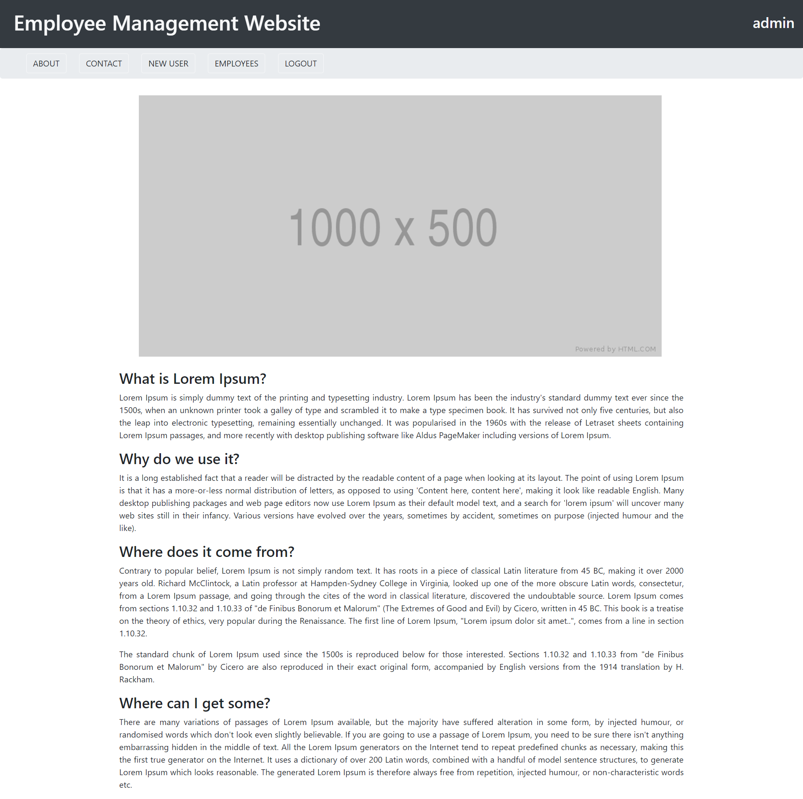

* About

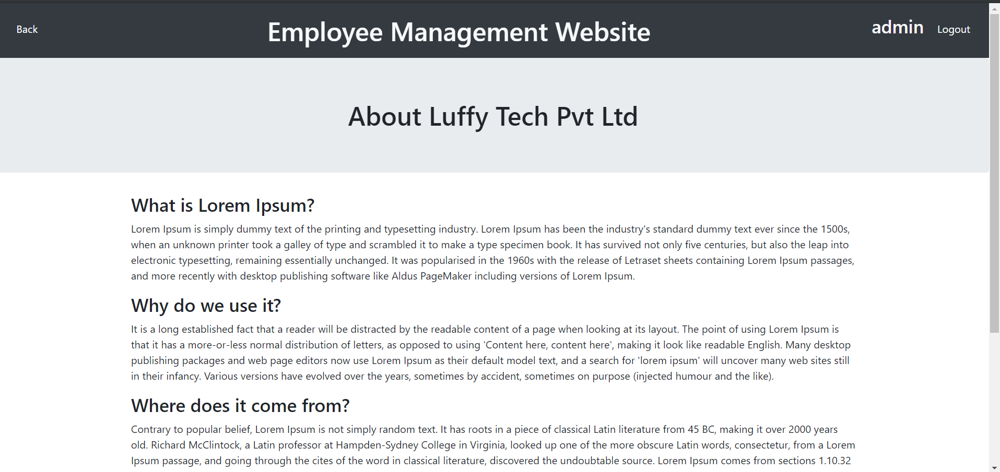

* Contact

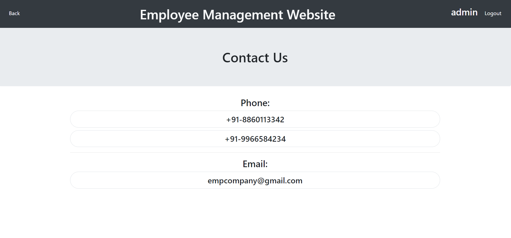

* Profile (employee only)


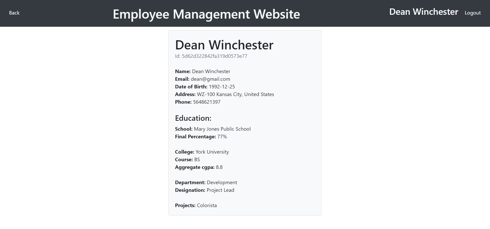

* Profile (admins only)

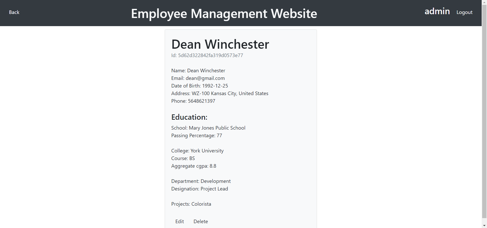

* Profile if details not added by employee (admins only)

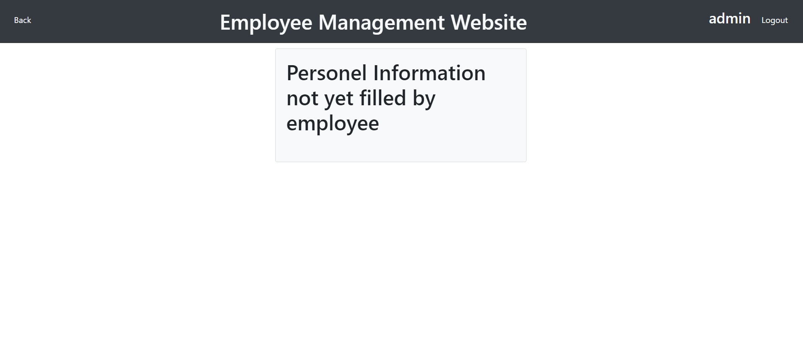

* New User (admins only)

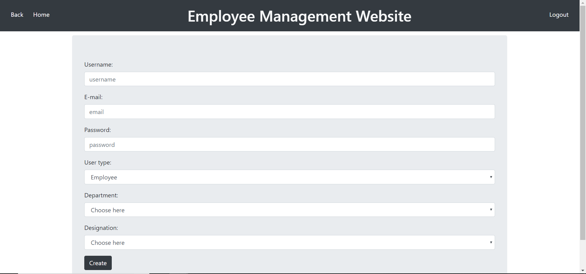

* Employees where top employees shows top 10 employees (admins only)

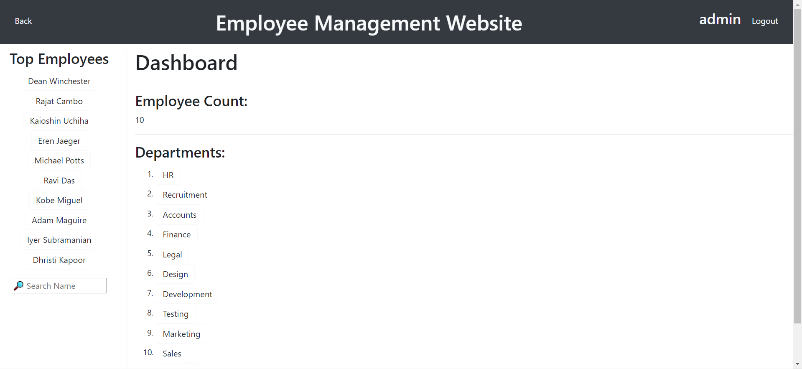

* SearchBar (admins only)

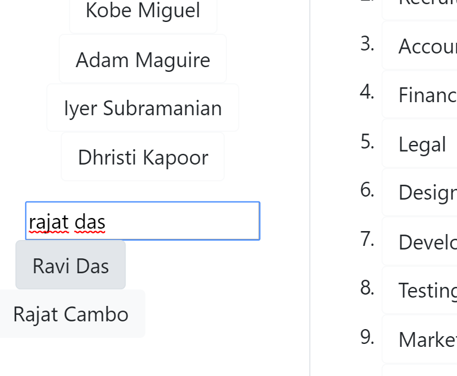

* All employees of a department (admins only)

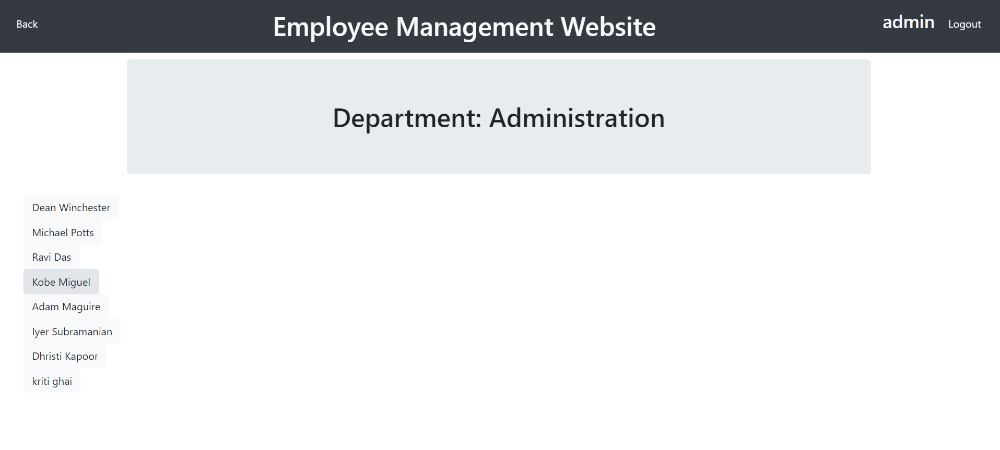

### Mobile Views 
* Login page

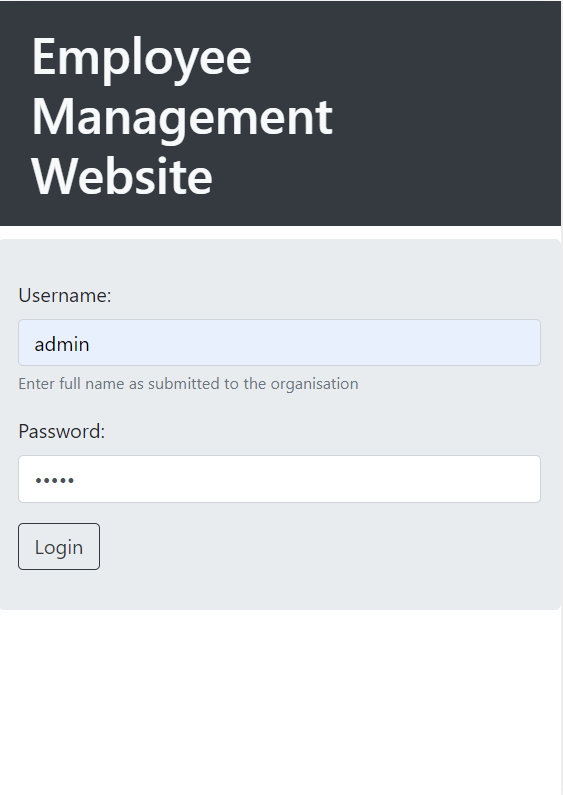 

* Home page (employees only)

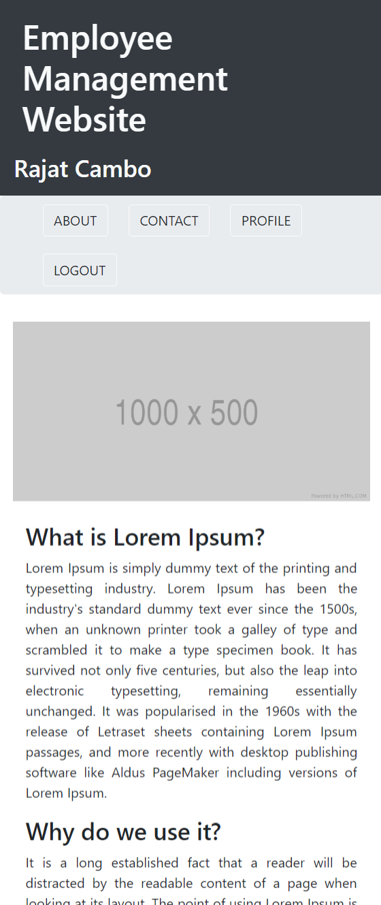

* Home page (admins only)

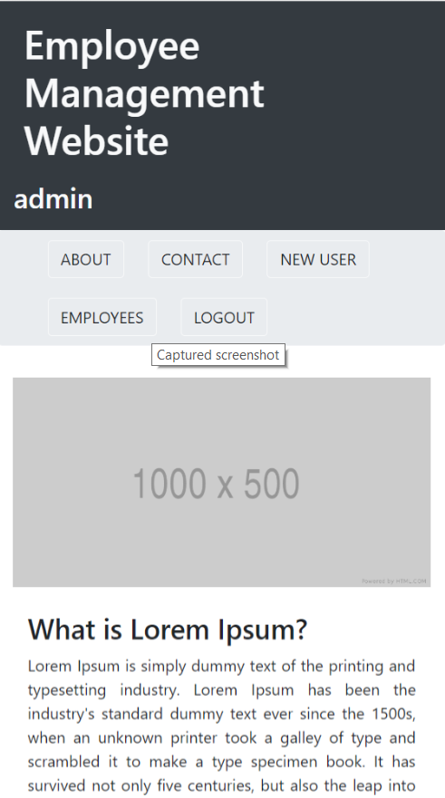

* About

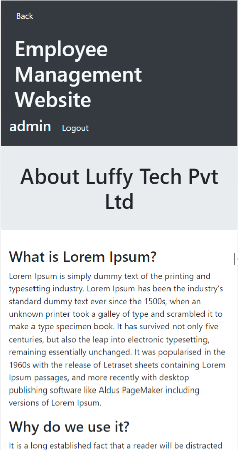

* Contact

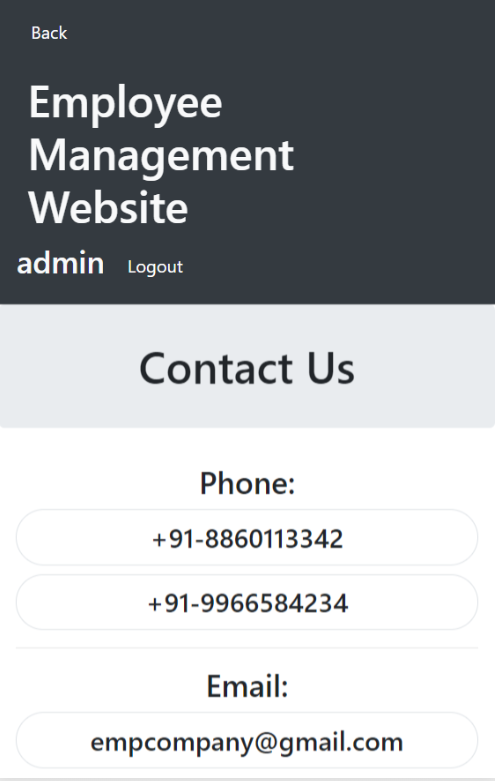

* Profile (employee only)

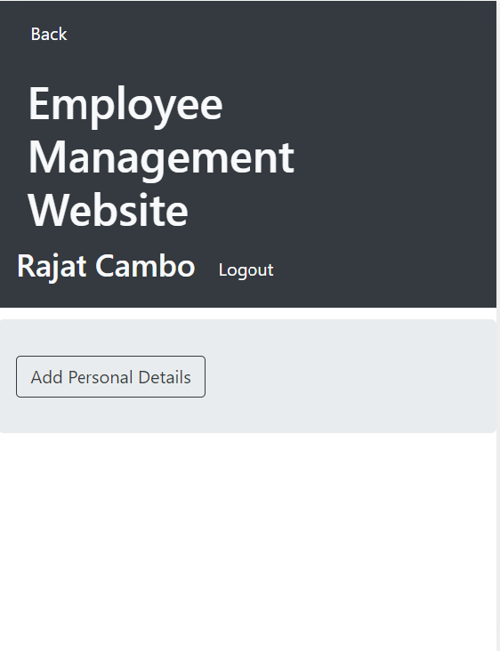


* Profile (admins only)

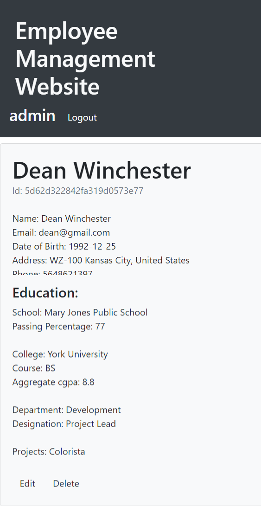

* Profile if details not added by employee (admins only)

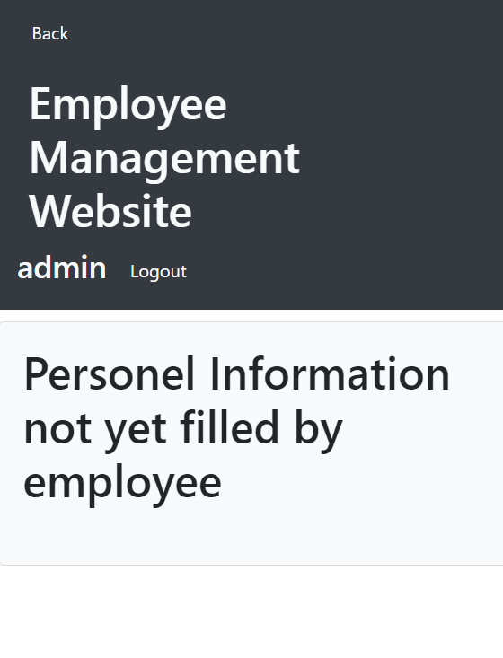

* New User (admins only)

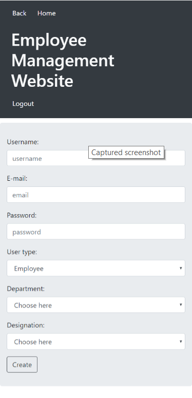

* Employees where top employees shows top 10 employees (admins only)


* SearchBar (admins only)


* All employees of a department (admins only)

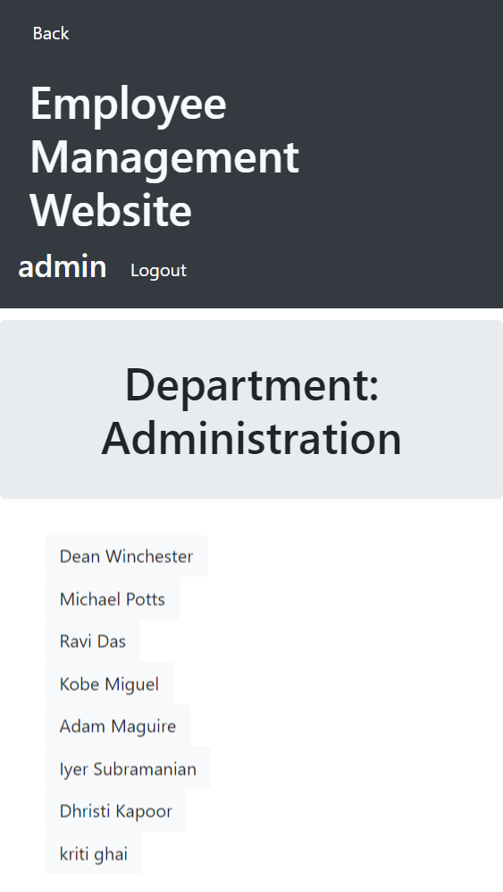

## Authors

* **Rajat Cambo** - [kaioshin20](https://github.com/kaioshin20)
